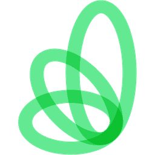

# About Me

I have spent over 4 years working in startup companies, building and expanding knowledge bases into powerful, intuitive user-facing doc sites. This has included CMS tooling migrations, improved automation and checks, and style guides ensuring consistent contributions.

## Work Experience

    

        
        

            <h3>Arine, <i>Technical Writer</i></h3>
            <h4>April 2025 - Present</h4>
            
Building out documentation for a dense knowledge base in a SDLC requiring flexibility and decisiveness. Assisting in large scale content migration into Document360.

        

    

    

        
        

            <h3>Kubecost, <i>Technical Writer</i></h3>
            <h4>June 2022 - June 2024</h4>
            
Maintained documentation repo as solo technical writer, working closely with engineers to develop docs on a monthly release schedule. Helped migrate knowledge base into Gitbook and provided training and contribution guidelines for team members to boost collaboration.

        

    

    

        
        

            <h3>MobiledgeX, <i>Technical Writer</i></h3>
            <h4>June 2021 - May 2022</h4>
            
Documented edge computing software product including API documentation, and generated graphic designs to showcase product utility and function.

        

    

    

        
        

            <h3>OpenMRS, <i>Technical Writer and Google Season of Docs Participant</i></h3>
            <h4>May 2021 - November 2021</h4>
            
Partnered with open-source medical records company OpenMRS to help streamline new member onboarding and generate page templates for Confluence knowledge base.

        

    

## Skills and Tooling

* **Documentation**: Markdown, Mkdocs, Docusaurus, HTML, CSS, Document360, Statamic, Gitbook

* **Development**: Github, Microsoft Office, Jira, Postman, Kubernetes, kubectl, helm, Visual Studio Code, Zendesk, Google Gemini, cURL

* **Design**: Adobe Photoshop, Adobe Illustrator, Figma, draw.io, SnagIt

## Processes and Workflow

* **Processes**: QA testing, version control, documentation architecture, content migration, open-source contributions

* **Methodologies**: Agile, docs-as-code

* **Content Types:** Product/software documentation, API docs, release notes, style guides, blogs, onboarding and installation guides, architecture diagrams, graphic design

 