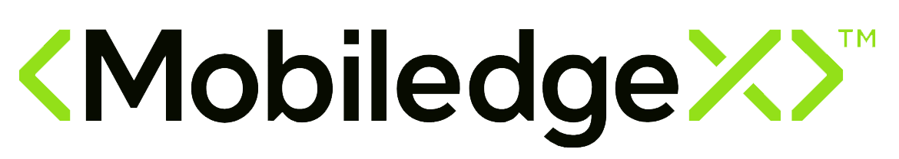

# Welcome to my portfolio!

My name is Brett, and I write docs.

## My Work

As a technical writer, I have worked in both software and healthcare companies, but my focus has been with fledgling startups, building out their knowledge bases with nowhere to go but forward. I have worked through multiple tool migrations, and have built out style and contribution guidelines for many companies as they look for a voice that represents their brand and their values. You can select from these company logos to learn more about my involvement with each.

  
  
  
  

## About This Page

This portfolio was built in GitHub and Visual Studio Code, written in Markdown, CSS, and Mkdocs Material, and hosted via GitHub Pages to demonstrate proficiency with syntax languages, static site generators, and version control tooling. For a deeper dive into my technical skillset, see the [About](about.md) page.

## First Visit?

I recommend to new visitors to start with my [Kubecost](kubecost/kubecost-overview.md) and [MobiledgeX](mobiledgex/mobiledgex.md) projects for a deep look into my professional work.

