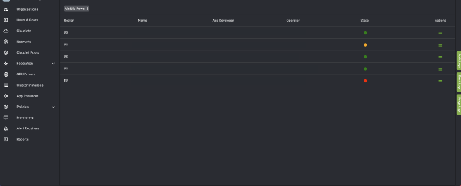

# Trust Policies

## What is a Trust Policy?

A trust policy replaces the default security group rule that permits all outbound traffic from a cloudlet with defined outbound
traffic rules. Trust policies are applied to cloudlets where you can apply rules to block all ports, some ports, or no ports. Once
you apply the trust policy to the cloudlet, any applications that are marked trusted will be deployed to the trusted cloudlet
where the outbound traffic rules are applied to those specific applications.

Note these guiding principles and other information about trust policies:
* Security group rules that are implemented are defined by the rules of the trust policy.
* Application instances can use all the outbound ports from the trust policy and are not restricted to just the application's
required outbound connections list.
* There are no restrictions to deploying trusted applications to non-trusted cloudlets.
* You cannot delete or modify trust policies where existing application instances are depending on those policies (required
outbound connections); however, you can delete or modify trust policies if they do not conflict with any deployed
applications requiring outbound connections, even though the application is using them. Last, applications can use all
outbound ports within the trust policy regardless of what is listed in the application's required outbound connections.
* Deployments must have the following list of ports to allow for outbound traffic in the trust policy:
    * DNS: UDP/53
    * To allow Envoy image to be pulled: TCP/443
    * NTP: UDP/123

## Create a Trust Policy

1.  In the left navigation of the Edge-Cloud Console, select **Policies**, then select **Trust Policies** from the dropdown menu.
The Trust Policy page opens.

    

2. On the Trust Policy screen, select the plus icon in the top right. The Create Trust Policy page opens.

    

3.  Populate the following mandatory fields:

    i.  **Region**: US or EU
    
    ii. **Organization**: This field should auto-populate with your active organization
    
    iii. **Trust Policy Name**: Choose a name for your trust policy

4. The default Full Isolation mode should be turned off, indicated by the switch being red. If it is not, select the button to
turn Full Isolation off, which will also display the Outbound Security Rules. This step is necessary to block all ports.
5. Set up your Outbound Security Rules.
6. Select **Create Policy**.

## Assigning a Trust Policy to a Cloudlet
Cloudlets and trust policies can be created and updated such that a trust policy can be assigned to a Cloudlet no matter
which of the two is created first.

When creating a cloudlet, you will have the option under Advanced Settings to apply an existing Trust Policy to the cloudlet.
However, if the desired trust policy is not available at the time of cloudlet creation, the cloudlet can be updated later. Read
about creating and updating your cloudlet [here](#trust-policies).

## Trust Policy Exceptions

A trust policy exception (TPE) is a list of protocol, CIDR, and/or port ranges similar to a trust policy. When a trust policy
defines firewall rules on a cloudlet which define outbound ports open to any app deployed on that cloudlet, all other ports are
closed. A TPE allows users to add exceptions to these rules by defining other outbound ports needed by the app that would
otherwise be closed by the initial trust policy.

Developers must define a TPE associated with a trusted app and a Cloudlet Pool. This cloudlet in the Cloudlet Pool must have
a trust policy assigned to it as well. Otherwise, the TPE will not create rules on the CRM and won't have any effect. Only
platform types VCD and OpenStack are supported for this cloudlet.

After this, the details of the TPE are unable to be modified, except for the Required Outbound Connections (but at least one
must still exist for the TPE at all times). Finally, you can approve or reject the TPE.

### Approving a trust policy exception

1. In the MobiledgeX Edge-Cloud Console, select **Policies** in the left navigation. From the dropdown menu, select **Trust
Policy Exception**. The Trust Policy Exception page opens.

    **Note**: The approval status of TPEs is determined in the State column, with one of three different colored dots. Green is the **Approved** icon, yellow is the **Approval Requested** icon, and red is the **Rejected** icon.

2. In the Actions column, select the Actions icon for your TPE with an **Approval Requested** state, then select **Update** from
the dropdown menu. The Update Trust Policy Exception page opens.
3. In the **Action** field, select **Approve** from the dropdown to approve the TPE.

    

4. Select **Update**. The TPE has now been approved and will be operational. This example screenshot shows all three
different states available for TPEs.

    